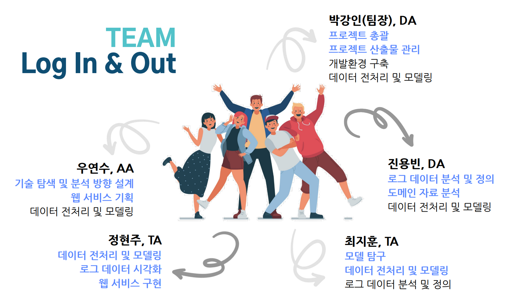

# LogInAndOut-log-severity-level-analysis

> 아시아경제 교육센터 파이썬 기반 응용AI 개발자 양성과정 프로젝트

## 프로젝트 소개

로그 데이터를 통해 시스템의 보안 위험도 등급을 예측하고 기존에 없던 패턴의 공격 탐지

> [Dacon - 로그 분석을 통한 보안 위험도 예측 AI 경진대회](https://dacon.io/competitions/official/235717/overview/description)

### 팀 소개

팀명: Log In & Out

팀원: 박강인, 우연수, 정현주, 진용빈, 최지훈

### 문서

[프로젝트 발표 자료](./로그인앤아웃_발표자료.pdf)

## 디렉토리 및 파일 안내

### 디렉토리
- `./EDA`: 각자 EDA를 수행 후 공유한 파일 모음
- `./share`: 전처리와 모델링 등을 수행하면서 공유한 파일 모음

### 최종 제출 코드
- [InAndOut_Final.ipynb](./InAndOut_Final.ipynb)
